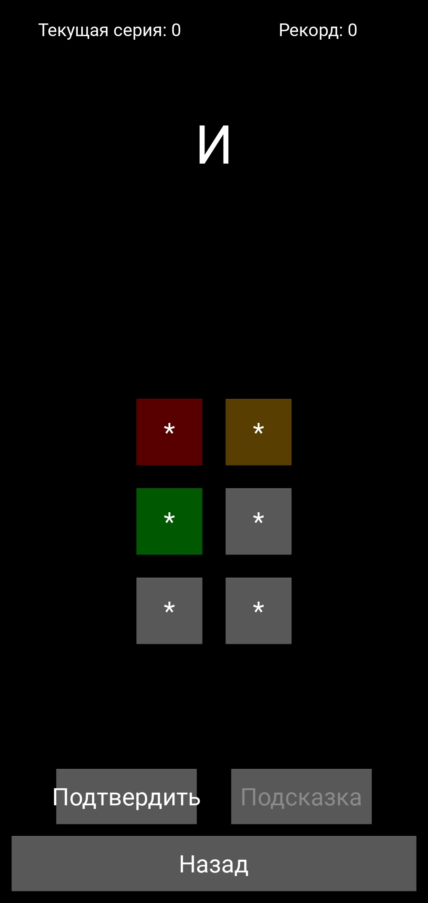
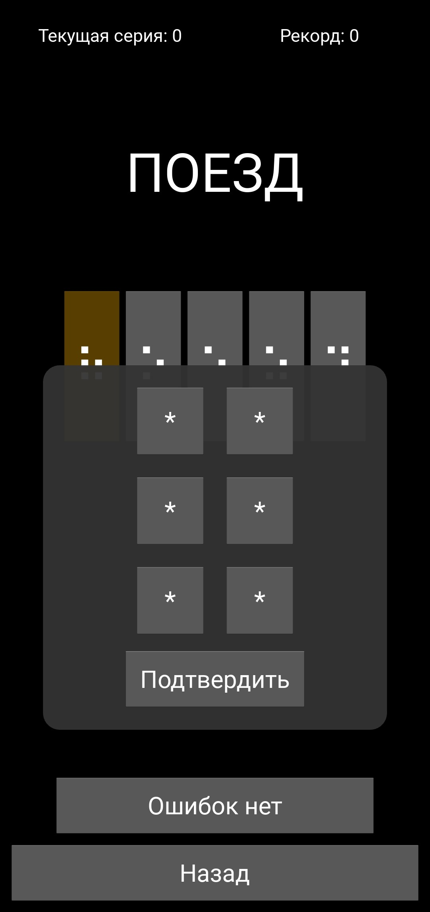
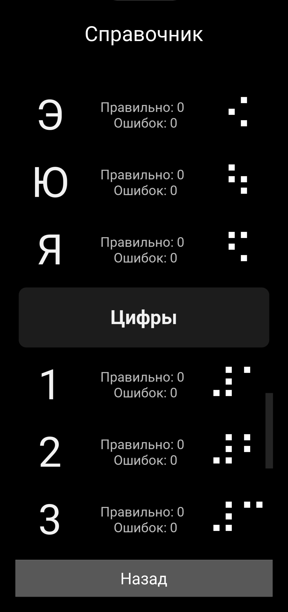
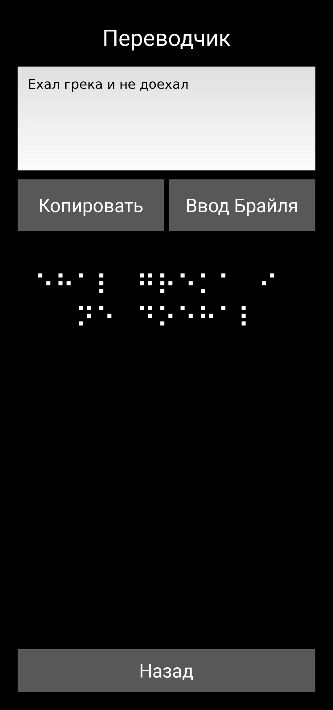
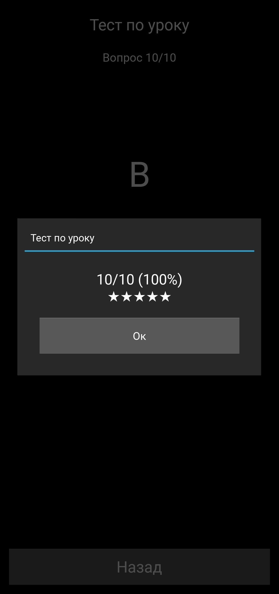
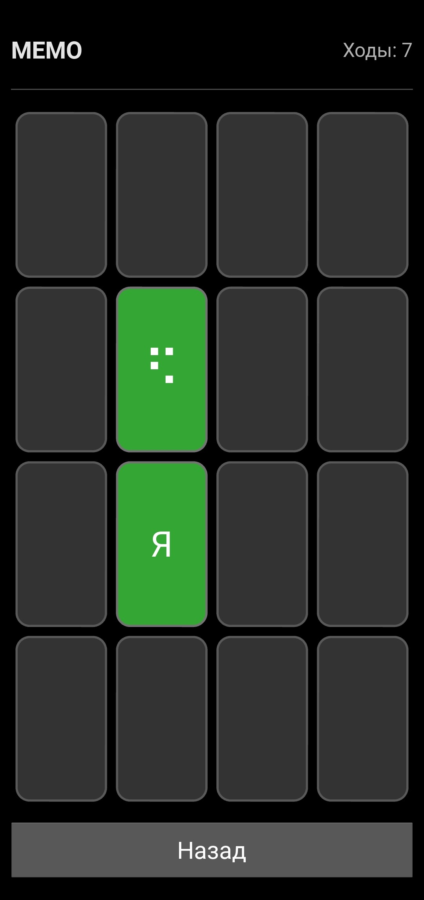

# Braille Learner 

[](./LICENSE)


> **Braille Learner** — это приложение для изучения и практики азбуки Брайля.
> Подходит для учащихся, педагогов, лингвистов и всех, кто интересуется тактильной письменностью.

---

## Возможности

| Режим | Описание |
|-------|----------|
| **Обучение** | • Буквы и цифры разбиты по разным модулям с тестом после каждого <br> • В самом конце есть контрольный зачет по всем буквам  |
| **Практика** (3 уровня) | • *Лёгкий*: выбор из 2–10 вариантов <br> • *Средний*: ввод символов Брайля на виртуальной клавиатуре 2×3 <br> • *Сложный*: найди и исправь ошибку в слове  <br> • *Быстрое повторение*: ответ за ограниченное время |
| **Справочник** | • Полная таблица алфавита с опциональной **статистикой по каждому символу** (*верно/неверно*). |
| **Переводчик** | • Текст → Брайль <br> • Ввод точек Брайля → распознавание буквы |
| **Игры** | • Позволяет учить брайль легко и интересно <br> •  Есть игры как **МЕМО** или **Филворд**|

---

## Поддерживаемые алфавиты

| Название |
|---------|
| English | 
| Русский |
| Дореволюціонный русскій |

## Быстрый старт

### Требования
- Python ≥ 3.10  
- [`kivy`](https://kivy.org/doc/stable/gettingstarted/installation.html)  
- Папка **assets** *(включенна в репозиторий)*

### Сборка
Используйте файл **setup.py**, либо проделайте эти шаги вручную:
```bash
# Скачайте данный проект
git clone https://github.com/AgentEvgen/BrailleLearner.git
cd BrailleLearner

# Установите зависимости
pip install kivy, buildozer

# Переносим файлы из подпапки buildozer в корень проекта
mv buildozer/* .

# Запустите конвертацию и ждите
buildozer -v android debug
```


## Скриншоты

|  |  |  |
| ----------------------------------------- | ----------------------------------------- | ----------------------------------------- |
|  |  |  |
